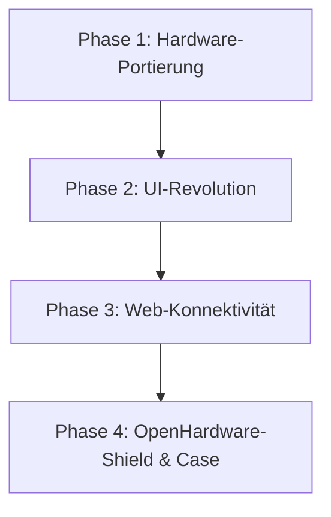

# 🍯 HaniMandl-resync 🔄

[](https://www.gnu.org/licenses/gpl-3.0)
[](https://www.espressif.com/en/products/socs/esp32-s3)
[](#roadmap)

Ein moderner, leistungsstarker und zukunftssicherer Fork des legendären **HaniMandl** – dem halbautomatischen Honig-Abfüll-Roboter. 

---

## 📖 Was ist der HaniMandl?

Der **HaniMandl** ist ein unverzichtbarer Helfer für Imkerinnen und Imker im deutschsprachigen Raum und darüber hinaus. Es handelt sich um ein Open-Source-Projekt für einen **halbautomatischen Honig-Abfüll-Roboter**. 

Mithilfe einer präzisen digitalen Waage (Load Cell mit HX711) und einem leistungsstarken Servo-Motor öffnet und schließt das Gerät den Quetschhahn des Abfüllkübels vollautomatisch. Sobald ein leeres Glas auf der Waage steht, tariert sich das System, öffnet das Ventil und stoppt den Abfüllprozess grammgenau bei Erreichen des Zielgewichts – inklusive intelligenter Autokorrektur des Nachlaufs.

---

## ⚖️ Warum dieser Fork? ("Hanimandl-resync")

Das Originalprojekt ist ein Geniestreich der Open-Source-Imkerei. Allerdings steht die Entwicklung des Originals seit geraumer Zeit nahezu still. Die Codebasis ist veraltet, unterstützt neue Mikrocontroller nur mangelhaft und das Benutzererlebnis entspricht nicht mehr modernsten Standards. 

**Hanimandl-resync** wurde ins Leben gerufen, um dieses großartige Projekt aus dem Dornröschenschlaf zu wecken. Wir überführen die bewährte Abfüll-Logik auf eine moderne Hardware-Plattform und fügen essenzielle Sicherheits- und Komfortfunktionen hinzu, die den Abfüllalltag revolutionieren.

---

## ⚡ Die Evolution: Original vs. HaniMandl-resync

| Feature | 🦖 Das Original | 🚀 HaniMandl-resync |
| :--- | :--- | :--- |
| **Mikrocontroller** | Heltec WiFi Kit 32 (V2/V3) *(teurer, proprietäres Pinout)* | **ESP32-S3** *(deutlich günstiger, extrem performant, natives USB)* |
| **Display** | 0.96 Zoll Monochrom-OLED *(winzig, anfällig für Einbrennen)* | **2.8 Zoll TFT Farb-Display** *(brillante Grafiken, Touch-Option, perfekte Lesbarkeit)* |
| **Betriebssicherheit** | Keine Schutzschaltung *(Servo-Spitzen können ESP-Resets auslösen)* | **Integrierte Pufferkondensatoren** *(Spannungsstabilisierung & Brownout-Schutz)* |
| **Komfort** | Stecken/Ziehen der Stromversorgung | **Dedizierter Hardware-An/Aus-Schalter** *(schnelle & sichere Bedienung)* |
| **Konnektivität** | Rein offline / lokale Bedienung | **Integrierter Webserver** *(Live-Tracking, Füllstatistiken & Datenexport)* |
| **Datenverwaltung** | Keine | **CSV/Excel-Download** *aller relevanten Abfülldaten (Chargen-Protokollierung)* |

---

## 🛠️ Die neuen Key-Features im Detail

### 📱 2.8 Zoll Farb-Display (TFT)
Das winzige monochrome Display weicht einem brillanten Farb-Bildschirm. Dies ermöglicht:
* **Farbkodierte Statusanzeigen** (z. B. *Grün* = Startklar, *Gelb* = Abfüllung läuft, *Rot* = Fehler/Not-Aus).
* **Dynamische Fortschrittsbalken** während des Füllvorgangs.
* **Mehr Platz für wichtige Informationen** wie Tara-Gewicht, Tageszähler, Chargennummer und Servowinkel auf einen Blick.

### 🧠 ESP32-S3 Powerhouse
Durch den Wechsel auf den ESP32-S3 erzielen wir signifikante Vorteile:
* **Drastische Kosteneinsparung** gegenüber dem teuren Heltec-Board.
* **Native USB-Unterstützung** für kinderleichtes Flashen und Debuggen.
* **Mehr Speicher (Flash/PSRAM)** für die Unterbringung des Webservers und schöner Grafiken.

### 🛡️ Hardware-Security & Ausfallsicherheit
Servomotoren ziehen beim Anfahren kurzzeitig sehr hohe Ströme. Beim originalen Aufbau führte dies nicht selten zu Spannungsabfällen (Brownouts), die den Mikrocontroller mitten im Betrieb abstürzen ließen – verheerend während eines laufenden Abfüllvorgangs!
* **Pufferkondensatoren:** Eine durchdachte Schutzbeschaltung puffert Stromspitzen zuverlässig ab.
* **Sicherer Betrieb:** Maximale Zuverlässigkeit, selbst bei schwergängigen Quetschhähnen oder schnellen Servobewegungen.

### 🎛️ Komfort & Smart-Home Integration
* **On/Off-Switch:** Ein echter physikalischer Schalter schützt die Elektronik und sorgt für eine ergonomische Handhabung direkt am Gerät.
* **Webserver & Live-Dashboard:** Über das lokale WLAN des HaniMandl lässt sich ein interaktives Dashboard aufrufen. Hier siehst du live das Füllgewicht, die Anzahl der abgefüllten Gläser und die aktuelle Füllgeschwindigkeit.
* **Datendownload:** Alle abgefüllten Chargen werden protokolliert und können zur Dokumentation (Lebensmittelhygiene-Verordnung!) direkt als **Excel/CSV-Tabelle heruntergeladen** werden.

---

## 🗺️ Roadmap / Meilensteine

Wir haben große Pläne für HaniMandl-resync. Die Entwicklung ist in klare, aufeinander aufbauende Phasen unterteilt:

```
📍 Phase 1: Die neue Basis (ESP32-S3 Portierung & PioArduino)
       │
       ▼
🎨 Phase 2: Visualisierung & UI-Design (2.8" TFT Farb-Display)
       │
       ▼
🌐 Phase 3: Webserver & Data Tracking (Live-Dashboard & Export)
       │
       ▼
🔌 Phase 4: Hardware-Reife (Eigenes PCB & 3D-Druck-Gehäuse)
```

<details>
<summary>📊 Interaktives Mermaid-Diagramm einblenden (für GitHub / kompatible Viewer)</summary>



</details>

### 📍 Phase 1: Die neue Basis (In Arbeit)
* [ ] **Portierung des Codes** auf den ESP32-S3 unter PioArduino (fork von PlatformIO).
* [ ] Integration und Test des HX711-Treibers sowie der neuen Servo-Bibliotheken für den S3.
* [ ] Aufbau des grundlegenden Pin-Mappings für den kostengünstigen ESP32-S3.

### 🎨 Phase 2: Visualisierung & UI-Design
* [ ] Implementierung der Grafik-Bibliothek (z.B. TFT_eSPI / LVGL) für das **2.8" Farbdisplay**.
* [ ] Design eines intuitiven, modernen User-Interfaces mit gut ablesbaren Schriftarten und klaren grafischen Elementen.
* [ ] Unterstützung von optionaler Touch-Bedienung zur Navigation in den Menüs.

### 🌐 Phase 3: Der Webserver & Data Tracking
* [ ] Implementierung eines **asynchronen Webservers** direkt auf dem ESP32-S3.
* [ ] Bereitstellung eines Live-Dashboards (WebSockets) zur Echtzeit-Visualisierung der Waage und des Füllstatus im Browser (Smartphone/Tablet/PC).
* [ ] Integration eines Dateisystem-basierten Logs (LittleFS) zur Speicherung aller Abfüllungen pro Charge.
* [ ] Exportfunktion für Füllprotokolle als **CSV- / Excel-kompatible Datei**.

### 🔌 Phase 4: Hardware-Reife (OpenHardware Shield)
* [ ] Design eines maßgeschneiderten **HaniMandl-resync PCBs (Platine)**, das den ESP32-S3, die Kondensatorschaltung, den On/Off-Switch und Steckplätze für Waage/Servo sauber vereint (kein Kabelsalat mehr!).
* [ ] Entwurf eines modernen, modularen **3D-Druck-Gehäuses**, welches das 2.8" Farbdisplay und den Hauptschalter ergonomisch einfasst.

---

## 🤝 Mitmachen!

HaniMandl-resync lebt von der Community. Wenn du Ideen hast, Fehler findest oder uns bei der Entwicklung (sei es Software, Platinendesign oder 3D-Gehäusedruck) unterstützen möchtest:

1. **Fork** das Repository.
2. Erstelle einen **Feature Branch** (`git checkout -b feature/NeuesFeature`).
3. Sende uns einen **Pull Request**.

> [!NOTE]
> Gemeinsam machen wir das Imkern noch smarter, sicherer und komfortabler! 🐝

---

### Lizenz
Dieses Projekt lizenziert sich unter der bewährten **GNU General Public License v3.0** (GPL-3.0). Details findest du in der [LICENSE](file:///Users/joshua/Desktop/hanimandl-resync/hanimandl-resync/LICENSE) Datei.
